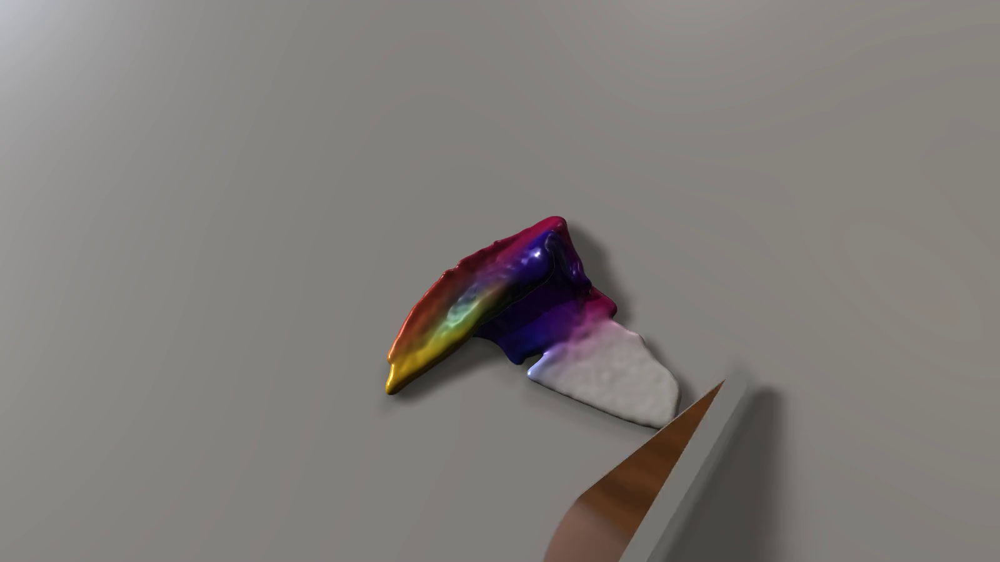
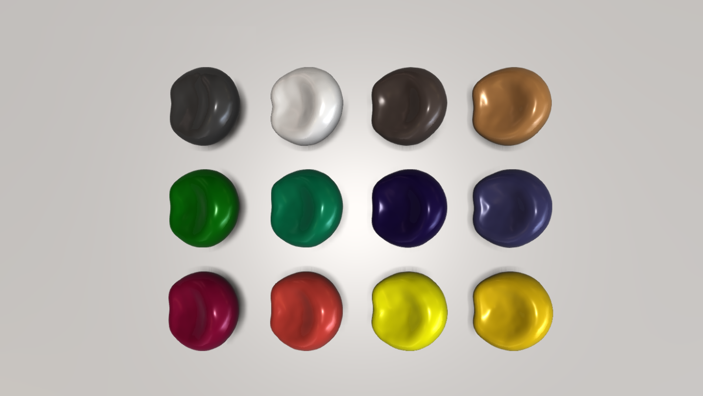
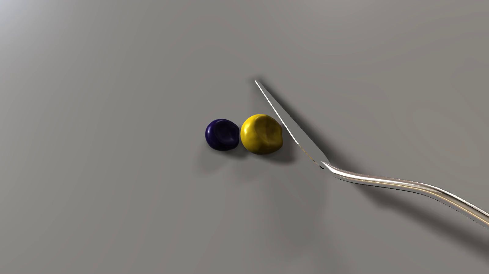
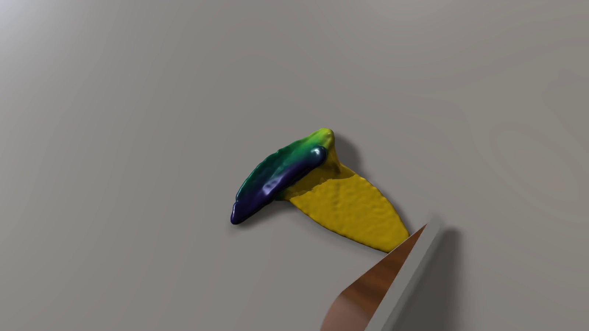

# Realistic Pigmented Material Mixture Simulation

This repository contains the implementation developed as part of my [Master's thesis](https://dspace.cvut.cz/entities/publication/1e409a08-c305-4adc-91a1-08fb2b57c61b) at the Faculty of Electrical Engineering, Czech Technical University in Prague.

The project focuses on the simulation and rendering of highly viscous pigmented paint mixed on a palette using a palette knife. The goal was to model the characteristic behavior of thick acrylic paint while providing realistic subtractive pigment mixing and a complete pipeline from physical simulation to rendered image sequences and videos.



## Goals

The main goals of the thesis were to:

- simulate the behavior of high-viscosity paint during interaction with a palette knife,
- represent the non-Newtonian and viscoplastic behavior of real acrylic paint,
- simulate pigment mixing instead of directly interpolating RGB colors,
- reconstruct and render the simulated paint surface,
- - use rheological measurements to characterize the behavior of real acrylic paint and inform the simulation parameters,
- and evaluate the resulting pigment mixtures using spectral measurements.

The final solution combines a Material Point Method (MPM) simulation, pigment-based color mixing, and a ray-marching renderer.

## How It Works

The fluid simulation is based on the MPM. Paint is represented by particles carrying physical quantities as well as pigment information. During each simulation step, particle data is transferred to a background grid, where the material dynamics are evaluated, and the resulting state is transferred back to the particles.

The Matter MPM solver was extended for the simulation of paint-like material and interaction with an animated palette knife. The palette knife is represented as a collision object using a signed distance field (SDF) and follows a predefined animation during the simulation.

Each paint particle also carries a latent pigment representation provided by Mixbox. Instead of directly interpolating RGB values, pigment information is mixed between particles during the simulation. The resulting pigment state is later converted back to RGB during rendering.

After simulation, the particle data is passed to an adapted version of the ray-marching renderer. The renderer was modified to process particle data produced by the MPM solver and to reconstruct both density and pigment information on a volumetric grid. The reconstructed paint surface is then rendered using adaptive ray marching, while the pigment data is evaluated to determine the resulting color.

## Pigment Colors

The simulation supports multiple acrylic paint pigment colors represented using the Mixbox pigment model.



Mixbox allows colors to behave more similarly to physical pigments during mixing. For example, mixing blue and yellow pigments produces green instead of the desaturated colors commonly produced by direct RGB interpolation.

## Results

The following example shows the initial state and the process of mixing blue and yellow paint using a palette knife.

<p align="center">
  
  
</p>

## Third-Party Work

This project combines and extends three existing projects. They provide the foundations for the physical simulation, rendering, and pigment mixing components.

### Matter

The physical simulation is based on [Matter](https://github.com/larsblatny/matter), an open-source C++ implementation of the Material Point Method with elasto-viscoplastic rheologies.

Matter was used as the foundation of the simulation component and was adapted to model the behavior of highly viscous acrylic paint. The simulation was further extended with animated palette knife interaction and support for pigment information carried by individual particles.

**Reference:**

> Blatny, L., and Gaume, J. (2025).  
> *Matter (v1): an open-source MPM solver for granular matter.*  
> Geoscientific Model Development, 18, 9149–9166.  
> https://doi.org/10.5194/gmd-18-9149-2025

### Ray-Marching Renderer

The rendering component is based on the implementation developed by
[Nikolaenkov](https://dspace.cvut.cz/entities/publication/d62bff86-705d-44e5-990e-1d1622d6342e)
as part of his bachelor's thesis.

The renderer was adapted to process particle data produced by the Matter MPM solver and use it for volumetric reconstruction.

The rendering pipeline was further extended to process pigment information carried by the MPM particles. Density and pigment data are reconstructed on volumetric grids, where the density field is used for surface rendering and the pigment representation is evaluated to determine the resulting paint color during ray marching.

The adaptive ray-marching approach used by the renderer is based on:

> Wu, T., Zhou, Z., Wang, A., Gong, Y., and Zhang, Y. (2022).  
> *A Real-Time Adaptive Ray Marching Method for Particle-Based Fluid Surface Reconstruction.*  
> Eurographics Symposium on Rendering.  
> https://doi.org/10.2312/sr.20221157

### Mixbox

Pigment-based color mixing is implemented using [Mixbox](https://github.com/scrtwpns/mixbox).

Mixbox converts input RGB colors into a latent pigment representation that can be interpolated to produce paint-like color mixtures. In this project, this representation was integrated directly into the particle simulation. Each paint particle carries pigment information that evolves as neighboring paint regions mix.

The pigment representation therefore connects the simulation and rendering components: pigment information is transported and mixed during the MPM simulation and converted back to RGB when the reconstructed paint is rendered.

**Reference:**

> Sochorová, Š., and Jamriška, O. (2021).  
> *Practical Pigment Mixing for Digital Painting.*  
> ACM Transactions on Graphics, 40(6), Article 234.  
> https://doi.org/10.1145/3478513.3480549

## Contributions

The main contribution of this thesis is the integration of physical paint simulation, pigment mixing, and volumetric rendering into a unified pipeline.

The implementation developed as part of the thesis includes:

- adaptation and parameterization of the Matter solver for highly viscous acrylic paint,
- implementation of animated palette knife interaction,
- integration of the Mixbox pigment representation into the MPM particles,
- implementation of shear-dependent pigment mixing during simulation,
- adaptation of Nikolaenkov’s renderer to particle data produced by Matter,
- reconstruction and rendering of spatially varying pigment information,
- and implementation of the complete simulation, export, and rendering workflow.

## Build and Usage

The project is configured to run inside a containerized development environment using Docker and Visual Studio Code Dev Containers. This provides a consistent environment with the required C++ libraries and build tools.

### Prerequisites

#### Windows

The following software is required:

- **Windows Subsystem for Linux 2 (WSL 2)** — required for running Linux-based Docker containers.
- **Docker Desktop** — the WSL 2 backend and integration with the selected Linux distribution must be enabled.
- **Visual Studio Code (VS Code)**.
- **Dev Containers extension for VS Code**.

#### Linux

The following software is required:

- **Docker Engine or Docker Desktop**.
- **Visual Studio Code (VS Code)**.
- **Dev Containers extension for VS Code**.

### Building the Project

The application is compiled using CMake. External C++ dependencies are managed through `vcpkg`, which is available inside the development container at `/opt/vcpkg/`.

From the project root directory, generate the build configuration:

```bash
cmake -S . -B build \
    -DCMAKE_TOOLCHAIN_FILE=/opt/vcpkg/scripts/buildsystems/vcpkg.cmake
```

Compile the application:

```bash
cd build
make -j4
```

The number of parallel compilation tasks can be adjusted according to the available processor cores, for example `-j8` or `-j16`.

### Running the Application

After compilation, the executable is located in `build/bin/`.

The application must be started from the `raytracing/` directory because it contains the required scene and rendering configuration files.

Starting from the `build/` directory, run:

```bash
cd ../raytracing
../build/bin/pigment-mixing
```

If graphical forwarding is configured correctly, the application window will open on the host system.

## Application Controls

The application is controlled in two stages. First, the initial paint configuration is selected. After the scene has been initialized, the camera can be adjusted and the simulation can be started.

### Initial Scene Configuration

The initial scene is configured through the application interface.

A mixture of **two to four paint colors** can be selected from a predefined set of Golden acrylic paint colors. A mixing ratio must be specified for each selected color.

The sum of the ratios is expected to equal `1`.

- If the sum is lower than `1`, the scene cannot be started.
- If the sum is higher than `1`, the ratios are automatically normalized.

### Scene Preview and Camera Controls

After the scene has been initialized, a preview representation is displayed. This allows the camera to be positioned before the more computationally expensive full rendering is enabled.

| Input | Action |
|---|---|
| `W` | Move the camera backward |
| `S` | Move the camera forward |
| `A` | Move the camera to the left |
| `D` | Move the camera to the right |
| Right mouse button + drag | Rotate the camera view |

The camera can only be modified before the simulation is started. This ensures that all generated animation frames use the same viewpoint.

### Starting and Controlling the Simulation

Press the **Space bar** to start the simulation. The selected camera configuration is then fixed, camera movement is disabled, and the application automatically switches from the preview representation to the full rendering mode.

The first **10 simulation frames** are used for stabilization and are not rendered or saved as part of the final animation.

During simulation, the following controls are available:

| Input | Action |
|---|---|
| `Space` | Pause or resume the simulation |
| `P` | Enable or disable frame saving |
| `F` | Enable or disable full rendering mode |

After the simulation has finished, the stored frames are automatically combined into an MP4 video.

Generated frames and videos are stored in:

```text
pigment-mixing/raytracing/output_images
```

## Configuration

Several application parameters can be adjusted using JSON configuration files. The default configuration can be used without modification for standard execution.

| Configuration file | Purpose |
|---|---|
| `sim_config.json` | Defines the physical material parameters used by the Material Point Method (MPM) simulation, including parameters related to numerical stability, density, deformation, cohesion, friction, and viscoplastic behavior. |
| `pigment_config.json` | Defines parameters controlling pigment transfer and diffusion during material deformation, including the temporary increase in pigment mixing during the main palette knife interaction. |
| `render_config.json` | Defines scene and animation settings, including the initial camera configuration, output frame rate, palette knife animation, environment map, material appearance, and scene lighting. |
| `colors_config.json` | Defines the predefined Golden acrylic paint colors available in the initial scene interface and their corresponding RGB input values. |

Paint colors and their mixing ratios are selected interactively when the application is started. Advanced simulation, pigment mixing, and rendering parameters can be adjusted through the configuration files.

## Third-Party Licenses

This repository contains or builds upon third-party software. The corresponding licenses and attribution requirements of the original projects apply to their respective components.

- **Matter** — GNU General Public License v3.0
- **Mixbox** — CC BY-NC 4.0
